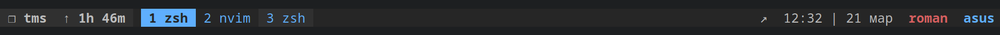

.tmux
=====

This is a copy of a file `.tmux.conf.local` from the [repository](https://github.com/gpakosz/.tmux)
I made some minor changes to create the tmux environment. 

This is copy [oh-my-tmux](https://github.com/gpakosz/.tmux)



If you like my work, then do the following

## Pre-Requirements

* Install [oh-my-tmux](https://github.com/gpakosz/.tmux) in `~/.config/tmux/`

## Installation

Installing in `~/.config/tmux`:

```bash
cd ~
git clone https://github.com/axemanofic/tmux-config ".tmux"
cp "~/.tmux/tmux.conf.local" "~/.config/tmux/tmux.conf.local"
```

Profit!

## Features

- Color-schema [Github Dark dimmed](https://primer.style/primitives/colors)

## From the author

Thank you for using this color scheme. 
If you like it please like it :heart:
